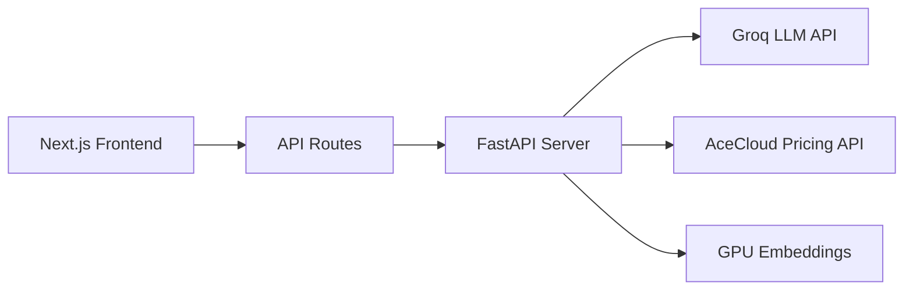

### Youtube Link: https://youtu.be/N5X2hod2xPI 
### CHATBOT  fastapi server Link: https://cloudyukti.onrender.com
### Live Link: https://cloud-yukti.vercel.app/
### PPT LINK : https://www.canva.com/design/DAGlV10WFH8/MXN0FAdfOvf9aLXzHP60lA/edit?utm_content=DAGlV10WFH8&utm_campaign=designshare&utm_medium=link2&utm_source=sharebutton
### VIDEO DRIVE : https://drive.google.com/file/d/1q16la5I_BLh1_-TPO-pxgfaMrxnsheTs/view?usp=drive_link

# CloudYukti - GPU Recommendation System
A Next.js-based intelligent GPU recommendation system powered by Groq LLM and AceCloud's GPU pricing API. Features real-time cost optimization suggestions and natural language interactions.

## Features

- 🤖 AI-powered GPU recommendations using Groq LLM
- 💰 Real-time pricing from AceCloud's API
- 💬 Interactive chatbot interface
- 🔄 Server-Sent Events (SSE) for streaming responses
- 🎯 Semantic search for GPU matching
- 📊 Cost optimization suggestions
- 🌐 Integration with FastAPI backend

## System Architecture



## Prerequisites

- Node.js 18.x or later
- Python 3.9+ (for FastAPI server)
- MongoDB running locally
- Groq API key
- AceCloud API access

## Installation

### 1. Clone the Repository

```bash
git clone https://github.com/AnshJain9159/CloudYukti
cd CloudYukti
```

### 2. Frontend Setup (Next.js)

```bash
cd ui
npm install
```

Create `.env.local` file in the `ui` directory:

```env
MONGODB_URI=mongodb://localhost:27017/CloudYukti
AUTH_SECRET="your_auth_secret" 
GROQ_API_KEY=your_groq_api_key
FASTAPI_URL=http://localhost:8000
```

### 3. Backend Setup (FastAPI)

```bash
cd server
python -m venv venv
# Windows
venv\Scripts\activate
# Linux/Mac
source venv/bin/activate

pip install -r requirements.txt
```

Create `.env` file in the `server` directory:

```env
GROQ_API_KEY=your_groq_api_key
```

## Running the Application

### 1. Start the FastAPI Server

```bash
cd server
uvicorn main:app --reload
```

The FastAPI server will run on `http://localhost:8000`

### 2. Start the Next.js Development Server

```bash
cd ui
npm run dev
```

The frontend will be available at `http://localhost:3000`

## Project Structure

```
CloudYukti/
├── ui/                     # Next.js frontend
│   ├── src/
│   │   ├── app/           # Next.js 13+ app directory
│   │   │   ├── api/       # API routes
│   │   │   │   └── yukti-bot/route.ts
│   │   │   │   └── gpu-recommender/route.ts
│   │   │   └── (root)/
│   │   │       └── yukti-bot/
│   │   └── components/    # React components
│   └── public/            # Static assets
└── server/                # FastAPI backend
    ├── server.py          # Main server file
    └── requirements.txt   # Python dependencies
```

## API Routes

### Frontend API (Next.js)

- `POST /api/yukti-bot`
  - Handles chat interactions
  - Streams responses from FastAPI

### Backend API (FastAPI)

- `POST /recommend`
  - Processes GPU recommendations
  - Integrates with Groq and AceCloud

## Environment Variables

### Frontend (.env.local)

| Variable | Description |
|----------|-------------|
| MONGODB_URI | MongoDB connection string |
| AUTH_SECRET | Authentication secret key |
| GROQ_API_KEY | Groq API key |
| FASTAPI_URL | FastAPI server URL |

### Backend (.env)

| Variable | Description |
|----------|-------------|
| GROQ_API_KEY | Groq API key |

## Usage Example

```typescript
// Example chat interaction
const response = await fetch('/api/yukti-bot', {
  method: 'POST',
  headers: { 'Content-Type': 'application/json' },
  body: JSON.stringify({
    messages: [{
      role: 'user',
      content: 'Recommend a GPU under ₹2000/hour for deep learning in Mumbai'
    }]
  })
});
```

## Contributing

1. Fork the repository
2. Create your feature branch (`git checkout -b feature/amazing-feature`)
3. Commit your changes (`git commit -m 'Add amazing feature'`)
4. Push to the branch (`git push origin feature/amazing-feature`)
5. Open a Pull Request

## Troubleshooting

### Common Issues

1. **FastAPI Connection Error**
   - Verify FastAPI server is running
   - Check FASTAPI_URL in .env.local

2. **Groq API Issues**
   - Verify GROQ_API_KEY is valid
   - Check API rate limits

3. **Streaming Issues**
   - Ensure proper SSE handling
   - Check network connectivity

## License

This project is licensed under the MIT License - see the [LICENSE](LICENSE) file for details.

